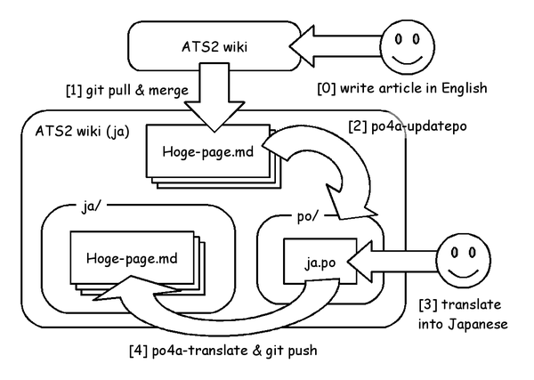

# ATS公式Wikiの日本語訳

このリポジトリは ATS 公式 Wiki https://github.com/githwxi/ATS-Postiats/wiki の日本語訳です。

[Home](ja/Home.md) からお読みください。
[全Wikiページリスト](ja) からページを指定して読むこともできます。

## 翻訳環境

### 概要

このリポジトリは [po4a](http://po4a.alioth.debian.org/) を使って以下のような翻訳ワークフローで管理されています。
もし誤訳などを見つけた方は拡張子が ".md" であるmarkdownファイルではなく、
["po/ja.po" ファイル](po/ja.po)
に pull request をいただけたら助かります。
ja.po の編集方法については、この後の
["[3] translate into Japanese" の章](#3-translate-into-japanese)
を読んでください。



### [0] write article in English

ATS 言語について、共有したい情報がありましたら "ATS 公式 wiki" https://github.com/githwxi/ATS-Postiats/wiki に英語で記事を書いてください。
この日本語 wiki に日本語で固有の情報を書くことはできません。必ず左記の公式 wiki に書いてから、この wiki リポジトリで日本語に翻訳するようにしてください。

### [1] git pull & merge

この作業は [JATS-UG のメンバー](https://github.com/orgs/jats-ug/people) が行ないます。

```
$ pwd
/home/kiwamu/doc/ATS-Postiats-wiki.jats-ug
$ git branch -a
* master
  translate_ja
  remotes/origin/HEAD -> origin/master
  remotes/origin/master
  remotes/origin/translate_ja
  remotes/upstream/master
$ grep -C 1 url .git/config
[remote "origin"]
        url = git@github.com:jats-ug/ATS-Postiats-wiki.git
        fetch = +refs/heads/*:refs/remotes/origin/*
--
[remote "upstream"]
        url = https://github.com/githwxi/ATS-Postiats.wiki.git
        fetch = +refs/heads/*:refs/remotes/upstream/*
$ git pull upstream master
remote: Counting objects: 3, done.
remote: Compressing objects: 100% (3/3), done.
remote: Total 3 (delta 2), reused 0 (delta 0)
Unpacking objects: 100% (3/3), done.
From https://github.com/githwxi/ATS-Postiats.wiki
 * branch            master     -> FETCH_HEAD
   8fb40af..f410a52  master     -> upstream/master
Updating c578a11..f410a52
Fast-forward
 ATS-LF.md => ATSLF.md                                               |
10 +++++-----
 Building-and-installing.md                                          |  4 ++--
 contrib.md => Contrib.md                                            |  6 ++----
 ATS-Libraries-and-C-Library-bindings.md => Contributed-Libraries.md |  0
 TODO.md                                                             |  2 ++
 atsdoc.md                                                           |  5 ++++-
 atslib.md                                                           |  2 +-
 7 files changed, 16 insertions(+), 13 deletions(-)
 rename ATS-LF.md => ATSLF.md (55%)
 rename contrib.md => Contrib.md (93%)
 rename ATS-Libraries-and-C-Library-bindings.md =>
Contributed-Libraries.md (100%)
$ git branch
* master
  translate_ja
$ git checkout translate_ja
Switched to branch 'translate_ja'
Your branch is up-to-date with 'origin/translate_ja'.
$ git merge master
Auto-merging Contrib.md
Auto-merging ATSLF.md
Merge made by the 'recursive' strategy.
 ATS-LF.md => ATSLF.md                                               |
10 +++++-----
 Building-and-installing.md                                          |  4 ++--
 contrib.md => Contrib.md                                            |  6 ++----
 ATS-Libraries-and-C-Library-bindings.md => Contributed-Libraries.md |  0
 TODO.md                                                             |  2 ++
 atsdoc.md                                                           |  5 ++++-
 atslib.md                                                           |  2 +-
 7 files changed, 16 insertions(+), 13 deletions(-)
 rename ATS-LF.md => ATSLF.md (55%)
 rename contrib.md => Contrib.md (93%)
 rename ATS-Libraries-and-C-Library-bindings.md =>
Contributed-Libraries.md (100%)
```

### [2] po4a-updatepo

この作業は [JATS-UG のメンバー](https://github.com/orgs/jats-ug/people) が行ないます。

```
$ make updatepo
po4a-updatepo -M utf8 -f text -m compiler-errors.md -m
Scientific-Computing.md -m Built-in-operators.md -m
Building-and-installing.md -m Internal-types.md -m tutorials.md -m
Strings.md -m safety.md -m ATSLF.md -m Stack-and-heap-allocation.md -m
Rosetta-Stone.md -m atslib.md -m Home.md -m code-generation.md -m
typechecking-errors.md -m Contributed-Libraries.md -m FAQ.md -m
dataviewtype.md -m runtime-errors.md -m staload.md -m
Built-in-constraint-solving.md -m overload.md -m char.md -m
Memory-leaks.md -m Typechecking-directives.md -m README.md -m type.md
-m effects.md -m atspkgreloc.md -m Built-in-datatypes.md -m TODO.md -m
loops.md -m dynload.md -m Error-messages.md -m Code-optimization.md -m
sort.md -m Frequently-asked-questions.md -m atsdoc.md -m template.md
-m Contrib.md -m Compiling-ATS-code.md -m Style-guide.md -p po/ja.po
........................................................................ done.
$ git diff|tail -20

 #. type: Plain text
-#: char.md:37
-#, no-wrap
+#: Contrib.md:25
 msgid ""
-"```ocaml\n"
-"(*\n"
-"   HX: the return is dynamically allocated\n"
-"*)\n"
-"fun tostring_char\n"
-"  (c: char):<> strnptr(1) = \"mac#%\"\n"
-"overload tostring with tostring_char\n"
-"```\n"
+"In order to switch between using these various packages, [[atspkgreloc|"
+"atspkgreloc]] is a useful tool that may automate the process. It can "
+"additionally be used with other repositories or forms of code storage."
 msgstr ""

 #. type: Plain text
```

### [3] translate into Japanese

["po/ja.po" ファイル](po/ja.po) を翻訳者が翻訳します。この翻訳作業はどなたでも Pull Request できます。

ja.po ファイルは以下のような内容を持ちます。

```
$ grep -C 9 "Welcome to the wiki for ATS2" po/ja.po
#. type: Plain text
#: atslib.md:5
msgid ""
"Examples using ATSLIB can be found in [doc/EXAMPLE/ATSLIB](../../tree/master/"
"doc/EXAMPLE/ATSLIB)."
msgstr ""

#. type: Plain text
#: Home.md:2
msgid "Welcome to the wiki for ATS2."
msgstr "ようこそ ATS2 wiki へ!"

#. type: Plain text
#: Home.md:4
msgid "The most recent released version of ATS2 is ATS2-0.1.1."
msgstr "ATS2 の最新リリース版は ATS2-0.1.1 です。"

#. type: Plain text
#: Home.md:6
```

これは [gettext](http://ja.wikipedia.org/wiki/Gettext) という翻訳ツールのファイル形式です。
簡単に言うと "msgid" が元の英語文、 "msgstr" が当該英語文を翻訳した結果の日本語文です。
翻訳をする際にはこの "msgstr" の欄を書くことになります。

この ja.po ファイルをそのまま編集しても良いのですが、gettext を編集するツールがあります。
どのツールがおすすめかということなのですが、git リポジトリとの相性の関係上、
[Emacs の PO Mode](https://www.gnu.org/software/gettext/manual/html_node/PO-Mode.html)
が一番良いと思われます。
他のツールは編集箇所以外の msgid や msgstr を崩してしまう傾向があるようです。

### [4] po4a-translate & git push

この作業は [JATS-UG のメンバー](https://github.com/orgs/jats-ug/people) が行ないます。

```
$ make
po4a-translate -M utf8 -f text -k 0 -m compiler-errors.md -p po/ja.po
-l ja/compiler-errors.md
po4a-translate -M utf8 -f text -k 0 -m Scientific-Computing.md -p
po/ja.po -l ja/Scientific-Computing.md
po4a-translate -M utf8 -f text -k 0 -m Built-in-operators.md -p
po/ja.po -l ja/Built-in-operators.md
--snip--
po4a-translate -M utf8 -f text -k 0 -m Contrib.md -p po/ja.po -l ja/Contrib.md
po4a-translate -M utf8 -f text -k 0 -m Compiling-ATS-code.md -p
po/ja.po -l ja/Compiling-ATS-code.md
po4a-translate -M utf8 -f text -k 0 -m Style-guide.md -p po/ja.po -l
ja/Style-guide.md
$ git status
On branch translate_ja
Your branch is ahead of 'origin/translate_ja' by 21 commits.
  (use "git push" to publish your local commits)
Changes not staged for commit:
  (use "git add <file>..." to update what will be committed)
  (use "git checkout -- <file>..." to discard changes in working directory)

        modified:   ja/Building-and-installing.md
        modified:   ja/Frequently-asked-questions.md
        modified:   ja/TODO.md
        modified:   ja/atsdoc.md
        modified:   ja/atslib.md
        modified:   po/ja.po

Untracked files:
  (use "git add <file>..." to include in what will be committed)

        ja/ATSLF.md
        ja/Contrib.md
        ja/Contributed-Libraries.md

no changes added to commit (use "git add" and/or "git commit -a")
$ git diff ja/Building-and-installing.md | tail
+If that does not work, it is worth trying to clean up ATSLIB as well:

     make -f codegen/Makefile_atslib cleanall

 The above make rule should be executed whenever one wishes to use updated
-[atslib] code from the upstream github repository.
+[ATSLIB] code from the upstream github repository.

 ## ATS in a virtual machine
$ git add .
$ git commit -m update
[translate_ja 4c55ee8] update
 9 files changed, 466 insertions(+), 293 deletions(-)
 create mode 100644 ja/ATSLF.md
 create mode 100644 ja/Contrib.md
 create mode 100644 ja/Contributed-Libraries.md
$ git push
Counting objects: 58, done.
Delta compression using up to 4 threads.
Compressing objects: 100% (57/57), done.
Writing objects: 100% (58/58), 11.82 KiB | 0 bytes/s, done.
Total 58 (delta 35), reused 0 (delta 0)
To git@github.com:jats-ug/ATS-Postiats-wiki.git
   1c3b274..4c55ee8  translate_ja -> translate_ja
```
